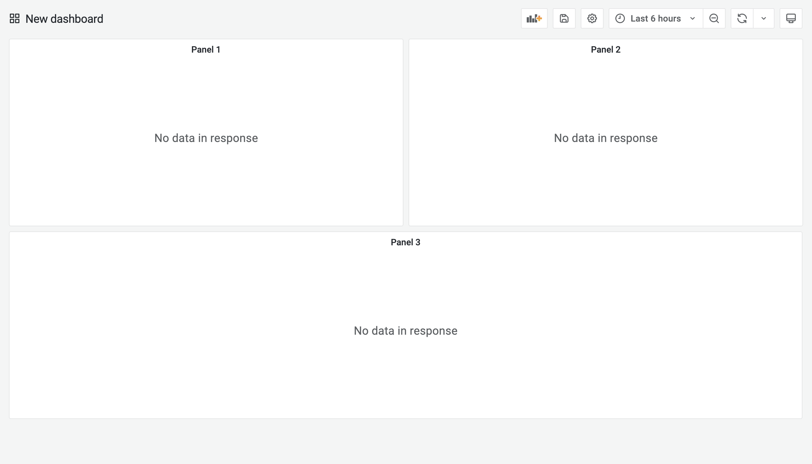

# Dash

Helps to create Grafana dashboards for our microservices.

```shell
npm install --global 
```

## Dashboard Layout

One of the tricky things to get right is positioning dashboard elements. The dashboard is divided into a grid (a bit like Bootstrap) and elements are positioned on a dashboard according to their `gridPos`. The grid is divided into 24 columns, so an element with width of 24 takes up the full width whereas an element with width of 8 takes up one third of the width.

Here is an example:



```javascript
[
  panelTemplate({
    "title": "Panel 1",
    "gridPos": {
      "h": 9,
      "w": 12,
      "x": 0,
      "y": 0
    }  
  }),
  panelTemplate({
    "title": "Panel 1",
    "gridPos": {
      "h": 9,
      "w": 12,
      "x": 12,
      "y": 0
    }  
  }),
  panelTemplate({
    "title": "Panel 1",
    "gridPos": {
      "h": 9,
      "w": 24,
      "x": 0,
      "y": 9
    }  
  }),
]
```